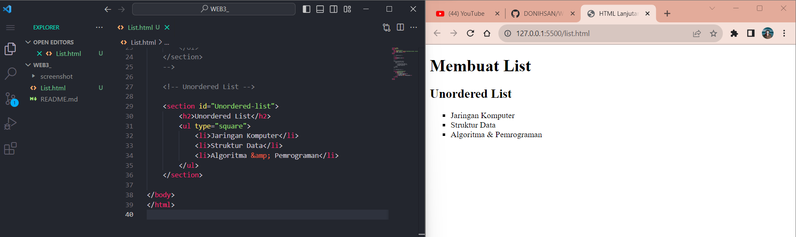

# Tugas Praktikum { Pertemuan ke 4 } 

|**Nama**|**NIM**|**Kelas**|**Matkul**|
|----|---|-----|------|
|Muhammad Ikhsan Fakhrudin|312210019|TI.22.A.2|Pemrograman WEB|

# HTML Lanjutan

## Langkah-langkah Praktikum

Membuka ``text editor`` , di sini saya menggunakan ***Visual Studio Code.***

## 1. Membuat Ordered List

## 2. Membuat Unordered List

## 3. Membuat Description List

## 4. Membuat Tabel

## 5. Menggabungkan Sel Data

## 6. Membuat Form

## 7. Menambahkan Style Pada Form

## Pertanyaan & Tugas

1. Buatlah Form Yang Menampilkan ``Dropdown Menu`` dan ``Listbox`` Dengan Multiple Selection.

## Jawab 

- File HTML Bisa di akses pada [(klik di sini)](https://github.com/DONIHSAN/WEB3_/blob/main/index.html)
- File CSS Bisa di askes pada [(klik di sini)](https://github.com/DONIHSAN/WEB3_/blob/main/style.css)

***Output :***

## SELESAI  
